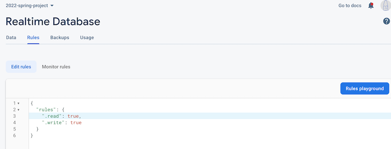

# Week 13A - More "Catch up"

## I. Project 1
- 9:30AM section is fully graded!
- Have started on 5:00 PM section
- ***Everyone who's project has not been graded, please fix your Firebase permissions if they've expired:***

**This rule will keep Firebase wide open for read/write**

**After I have graded these projects, you should probably change write to `false`:**

## II. Project 2
- [Project 2 - *Interactive Sandbox of Awesomeness*](../projects/p2.md)
- [Project 2 - Interactive Sandbox of Awesomeness - Overview & Tips](../projects/p2-overview-and-tips.md)
- Project 2 Ideas have been submitted:
  - **9:30AM (19 Projects)**
    - 11 Audio Visualizers
    - 5 Games:
      - 2 "Sprite Shooters"
      - 1 "Avoid things" Game
      - 1 Falling Sand/Platformer Game
      - 1 Puzzle Game (2048 clone)
     - Other Audio Visualizer/Mashup
       - AV/Platformer Mashup
       - Rhythm Game
   - **3:30PM (23 Projects)**
     - 9 Audio Visualizers
     - 6 Games:
       - Walker GA Game
       - Shooter
       - Conway's Game of Conquest
       - Connect 4/Falling Sand?
       - Tower Defense
       - Bonsai Sim
     - 3 Other Audio Visualizer/Mashup
       - Random Music Dungeon Level Generator
       - Rhythm game
       - AV Platformer
     - 5 `ml5`
       - PoseNet - Falling Sand Sim
       - PoseNet - Head-butt Volleyball
       - PoseNet - Falling Fruit
       - PoseNet - Match the Pose
       - PoseNet - Cooking Physics Simulator
   - **5:00PM (18 Projects)**
     - 8 Audio Visualizers
     - 7 Games:
       - Sprity Dodge Game
       - Tile-based Matching Game
       - Pocket God clone
       - Simple Farm Sim
       - Minesweeper
       - Sprite-based game with AV (for aesthetics)
       - Phyllotaxis Game
     - 1 Other Audio Visualizer/Mashup:
       - Rhythm Game
     - 2 `ml5`
       - Teachable Machine Art Gallery
       - PoseNet Piano
 - General Project Idea Feedback
   - 

## III. Web Audio
- Now, we head back to  [**Week 12A Notes**](12A.md) 

| <-- Previous Unit | Home | Next Unit -->
| --- | --- | --- 
| [**Week 12B Notes**](12B.md)     |  [**IGME-330 Schedule**](../schedule.md) | Week 13B Notes
