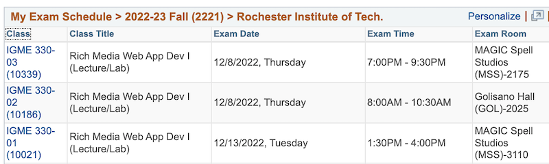

# Week 14A

## I. Project II Questions?

- [Project 2 - *Interactive Sandbox of Awesomeness*](../projects/p2.md)
- [Project 2 - Interactive Sandbox of Awesomeness - Overview & Tips](../projects/p2-overview-and-tips.md)

## II. Web Audio Demos
- **filter-example-plus-wa.ZIP**
  - in myCourses
  - size and speed of sprites based on loudness of bins
- Build on 13A in-class demo
  - work with `imageData.data` array and modify pixel components based on audio characteristics

## III. Final Exam

### III-A. Date/Time & Location (from SIS)

- If you are scheduled to take the exam on 12/13, but this interferes with your travel plans, you may request to take the exam on one of the 12/8 times, but you must request to do so *in advance, by DMing me in Slack prior to the start of our next class meeting*
- Be sure to indicate which 12/8 time you are interested in!

## III-B. Exam Review

- The exam is *cumulative* - meaning that everything we have covered this semester is fair game
- Resources:
  - **quiz-1 PDF** (see myCourses)
    - [Quiz #1 Review](04A.md#i-review-quiz-1)
  - **quiz-2 PDF** (see myCourses)
    - [Quiz #2 Review](06A.md#i-review-quiz-2)
  - [Midterm Exam Prep](07A.md#i-midterm-exam-is-next-time)
  - **330-final-exam-prac-1.pdf** (see myCourses)
  - **330-final-exam-prac-2.pdf** (see myCourses)
- Topics covered (since midterm)
  - localStorage demo ([7A](07A.md#iii-localstorage-demo))
  - Firebase ([8B](08B.md#iii-firebase-notes))
  - [Firebase 4 - Creating a Likes Counter](https://github.com/tonethar/IGME-330-Master/blob/master/notes/firebase-4.md)
  - Canvas
    - [Week 9B - CS-1/2/3/4/5](09B.md)
    - [Week 10B - CS-6/7/8](10B.md#iv-more-canvas-core-skills)
    - [Week 13B - Drawing images & Blending Modes](https://github.com/tonethar/IGME-330-Master/blob/master/notes/canvas-5.md)
    - Study Guide #2 (see myCourses)
  - Node.js
    - [10A - Node.js Intro](10A.md#iii-nodejs)
    - [Bundling & Transpiling JS](https://github.com/tonethar/IGME-330-Master/blob/master/notes/node-and-transpiling.md)
    - [Intro to TypeScript](https://github.com/tonethar/IGME-330-Master/blob/master/notes/intro-typescript.md)
  - ["Creative Coding" with Canvas](11A.md)
  - [Machine Learning with ml5](11B.md#ii-machine-learning-with-ml5)
  - Web Audio
    - [HW - Audio Visualizer - Part I](https://github.com/tonethar/IGME-330-Master/blob/master/notes/HW-AV-2195-1.md)
    - [HW - Audio Visualizer - Part II](https://github.com/tonethar/IGME-330-Master/blob/master/notes/HW-AV-2195-2.md)
    - [HW - Audio Visualizer - Part III](https://github.com/tonethar/IGME-330-Master/blob/master/notes/HW-AV-2195-3.md)
    - [Web Audio I - Build a Simple Audio Visualizer](https://github.com/tonethar/IGME-330-Master/blob/master/notes/demo-web-audio-1.md)
    - [Web Audio II - Treble, Bass & Distortion Nodes](https://github.com/tonethar/IGME-330-Master/blob/master/notes/demo-web-audio-2.md)
  

| <-- Previous Unit | Home | Next Unit -->
| --- | --- | --- 
| [**Week 13B Notes**](13B.md)     |  [**IGME-330 Schedule**](../schedule.md) | Week 14B Notes
